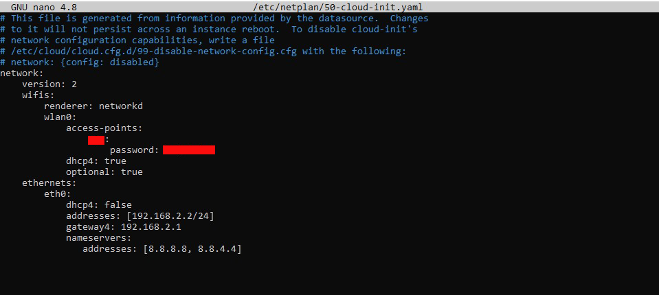

<p align="center"></p>
<h1 align="center">Raspberry Pi 4 with Ubuntu 20.04 LTS 64-bit ARM Server</h1> 
<h4 align="right">February 24</h4>

<br>


<br>

# Table of Contents
- [Table of Contents](#table-of-contents)
- [How to Setup WiFi on Raspberry Pi 4 with Ubuntu 20.04 LTS 64-bit ARM Server](#how-to-setup-wifi-on-raspberry-pi-4-with-ubuntu-2004-lts-64-bit-arm-server)
- [Setting SSH Ubuntu Server 20.04](#setting-ssh-ubuntu-server-2004)
- [How to Set Up SSH Key on Windows 10](#how-to-set-up-ssh-key-on-windows-10)
- [Troubleshooting](#troubleshooting)
    - [SSH Permission Denied (publickey)](#ssh-permission-denied-publickey)
    - [Password Authentication](#password-authentication)
- [Ubuntu RPi Static IP Address](#ubuntu-rpi-static-ip-address)
    - [Command below to find details of the available adapters](#command-below-to-find-details-of-the-available-adapters)
- [Find YAML file](#find-yaml-file)
- [Respaldar archivo origial de configiración](#respaldar-archivo-origial-de-configiración)
- [Make configuration changes](#make-configuration-changes)
- [Validate Configuration File](#validate-configuration-file)
- [Apply and test the changes](#apply-and-test-the-changes)
- [Validate changes](#validate-changes)
- [Restart the Network Service (Optional):](#restart-the-network-service-optional)
- [YAML file](#yaml-file)
- [How to Set a Static IP Using the GUI](#how-to-set-a-static-ip-using-the-gui)
- [Temporary IP address assignment](#temporary-ip-address-assignment)
  
  

<br>

# How to Setup WiFi on Raspberry Pi 4 with Ubuntu 20.04 LTS 64-bit ARM Server

1. Find WiFi card name:
```
$ ls /sys/class/net
eth0  lo  wlan0
```

2. Edit network configuration file to add WiFi info:
```
sudo nano /etc/netplan/50-cloud-init.yaml
```

3. adding your WiFi info

4. Save the file and reboot

5. Update
```
sudo apt-get update && sudo apt-get upgrade && sudo apt dist-upgrade
sudo reboot
```
<br>

# Setting SSH Ubuntu Server 20.04 

1. Create Folder <br>
Create the directory if required
```
sudo mkdir ~/.ssh
sudo nano ~/.ssh/authorized_keys
```

2. Permissions
```
chmod 700 ~/.ssh
chmod 600 ~/.ssh/authorized_keys
```

3. Verify Password Authentication
```
cat /etc/ssh/sshd_config | grep PasswordAuthentication
```
Debe decir "Yes". sino cambiar con el siguiente comando:

```
sudo nano /etc/ssh/sshd_config
```
Change ```PasswordAuthentication``` from no to ```Yes```. Save the file and restart the SSH service

4. Service ssh restart
```
sudo systemctl restart ssh
```

<br>


# How to Set Up SSH Key on Windows 10 
(with PowerShell / GitBash Terminal)

1. generate SSH keypair
```
ssh-keygen
```

2. Copying the Public Key to Your Ubuntu Server
```
ssh-copy-id username@server_ip
```
si hay error revisar Troubleshooting

 3. Authenticating to Your Ubuntu Server Using SSH Keys
```
ssh username@remote_host
```

<br>

> :bulb: **Tip:** Copying the Public Key to Your Ubuntu Server and create folder (one command)
```
cat ~/.ssh/id_rsa.pub | ssh username@remote_host "mkdir -p ~/.ssh && touch ~/.ssh/authorized_keys && chmod -R go= ~/.ssh && cat >> ~/.ssh/authorized_keys"
```


Creating and Using SSH Keys with GUI: https://www.purdue.edu/science/scienceit/ssh-keys-windows.html

<br>

# Troubleshooting 

### SSH Permission Denied (publickey) 
probar si esta corriendo el servivio de SSH
```
sudo systemctl status sshd
```

ver la llave publica
```
cat ~/.ssh/id_rsa.pub
```

### Password Authentication
If public key authentication is not working, you can temporarily enable password authentication to troubleshoot further. Open the SSH configuration file on the remote server:
```
sudo nano /etc/ssh/sshd_config
```
Change ```PasswordAuthentication``` from no to ```Yes```. Save the file and restart the SSH service

```
sudo systemctl restart ssh
```
<br>

# Ubuntu RPi Static IP Address
```Configure Static IP Address via Netplan Configuration File``` <br>
Netplan is a utility for easily configuring networking on a Ubuntu Linux system. Introduced in Ubuntu 18.04 and later versions, Netplan has become the default network management tool.

It uses ```YAML``` configuration files, offering a declarative approach to network configuration.


### Command below to find details of the available adapters
```
ip a
```
```
ls /sys/class/net/
```
``` 
ifconfig -a
```

Note the current network adapter name:
```
eth0  lo  wlan0
```


# Find YAML file
el siguiente directorio /etc/netplan/ alli deberíamos poder ver un archivo con extension .yaml
```
ls /etc/netplan/
```

```
01-network-manager-all.yaml // // Para el caso de Ubuntu Server 18.04
00-installer-config.yaml // Para el caso de Ubuntu Server 20.04
50-cloud-init.yaml  // The following worked for me in Ubuntu 22.04
```

# Respaldar archivo origial de configiración
samples:
```
cp /etc/netplan/00-installer-config.yaml /root/00-installer-config.yaml.org
cp /etc/netplan/50-cloud-init.yaml /home/<User>/50-cloud-init.yaml.backup
```

# Make configuration changes
```
sudo nano /etc/netplan/50-cloud-init.yaml
```
para eth0
```
ethernets:
   eth0:
     dhcp4: false
     addresses: [192.168.2.2/24]
     gateway4: 192.168.2.1
```
NOTA: La identacion es MUY importante!

<p align="center"></p>

<br>

# Validate Configuration File
Before applying any changes, always validate the configuration using the command:
```
sudo netplan generate
```

# Apply and test the changes
```
sudo netplan try
```

# Validate changes
```
ip a
```
en la consola:
```
eth0
inet: <ip que pusimos>
```


# Restart the Network Service (Optional):
```
sudo systemctl restart systemd-networkd
```
```
sudo reboot
```

# YAML file
The top-level node in a Netplan configuration file is a ```network:```<br>
```version: 2``` means that it is using network definition version 2 <br>
```renderer``` is systemd-networkd by default, but we'll set it to networkmanager or networkd.<br>
```Adapter name:``` wifis, ethernets, modems or bridges. <br>
```dhcp4```: indicamos si queremos que el protocolo ipv4 utilice DHCP para la asignación de IP(no,yes, true,false)<br>
```dhcp6```: Igual que en el ipv4 pero en este caso con ipv6<br>
```addresses```: lista de direcciones en formato xxx.xxx.xxx.xxx/yy en donde yy son los bits que usamos para la máscara. Si nuestra máscara de subred es 255.255.255.0 entonces sería /24. <br>
```gateway4```: la puerta de enlace predeterminada de la ipv4<br>
```gateway6```: Igual que en el ipv4 pero en este caso con ipv6<br>
```nameservers```: . Aquí vamos a indicar la direcciones ip, mas conocidas como direcciones DNS. Las ponemos entre [] y podemos separarlas por comas como lo podemos ver en el ejemplo indicado. <br>

# How to Set a Static IP Using the GUI
https://www.freecodecamp.org/news/setting-a-static-ip-in-ubuntu-linux-ip-address-tutorial/

# Temporary IP address assignment
To use this command to add a temporary IP address, we need to use the 'add' and 'dev' options with the command.
```
ip addr add [ip_address/subnet_mask] dev [interface_name]

```
samples:
The following command adds the IP address 192.168.1.10/24 to the ens160 interface.
```
ip addr add 192.168.1.10 255.255.255.0 dev ens160
```
To verify the new IP address, you can check the IP configuration of the device again.
```
ip addr ens160
```

To force Linux to reread this file, you can use the ifdown and ifup commands. Specify the interface name as the argument with these commands.
```
ifdown ens160
ifup ens160
```

other sample:
```
sudo ip addr add 10.102.66.200/24 dev enp0s25
ip link set dev enp0s25 up
ip link set dev enp0s25 down

ip address show dev enp0s25
```


<br>

---
Copyright &copy; 2022 [carjavi](https://github.com/carjavi). <br>
```www.instintodigital.net``` <br>
carjavi@hotmail.com <br>
<p align="center">
    <a href="https://instintodigital.net/" target="_blank"></a>
</p>
